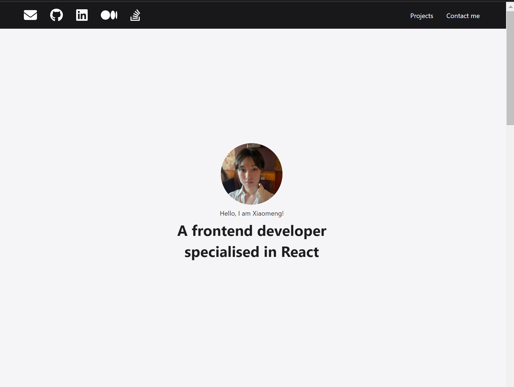
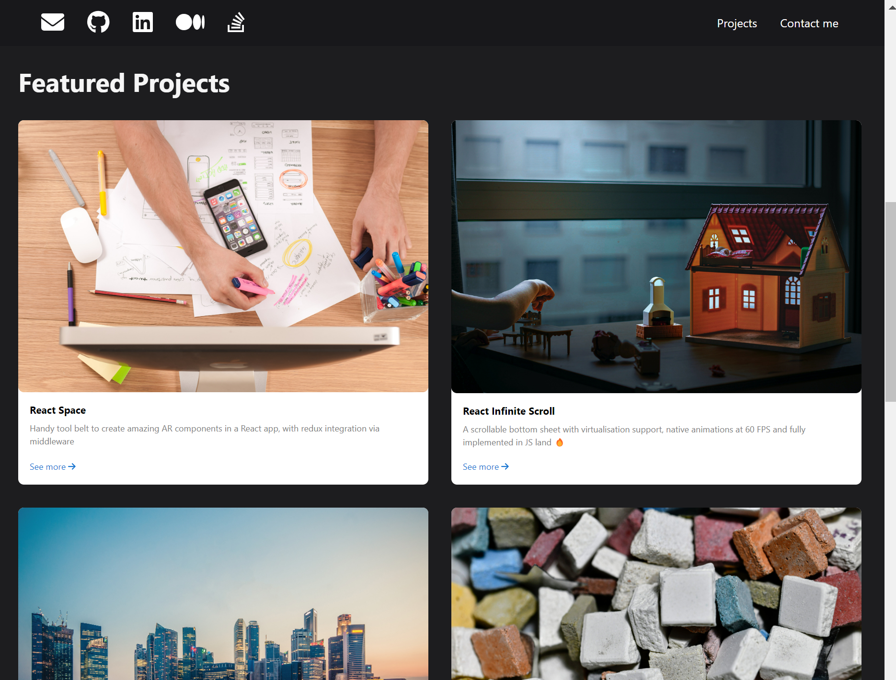
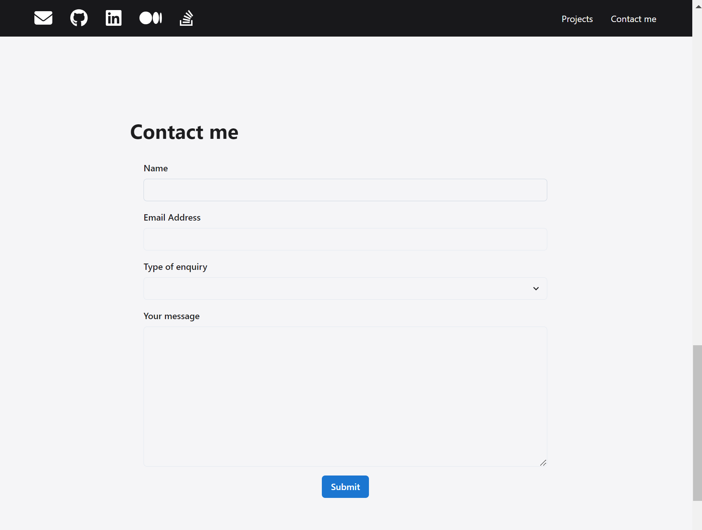
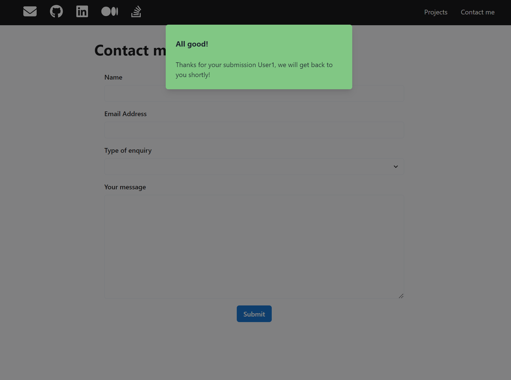

# Personal website template
This is a personal website template using React.
## Overview
This personal website template consists of three sections: Landing page, Projects and Contact Me.
### Landing page section
This section displays your avatar and a short discreption of yourself.

### Projects section
This section highlights the insteresting projects that you wish to showcase on your website. Each project is presented with an image, a textual description, and a link to the project github page.

### Contact Me section

This section enables users to send you messages via your website. All fields must be filled in, and the email address must be valid. Upon successful submission of the message, users will receive a prompt of success message:



## Usage
### Installation
Download and install Node.js first. Node.js 16.x or higher is required.

After cloning this repo, `cd` to the project directory and install the required dependencies using the npm install command:

```bash
$ npm install
```
### Running the project
Launch the development server with 
```bash
$ npm start
```
which starts a server with hot reloading enabled. The application can be accessed at `http://localhost:3000`

## Usage

